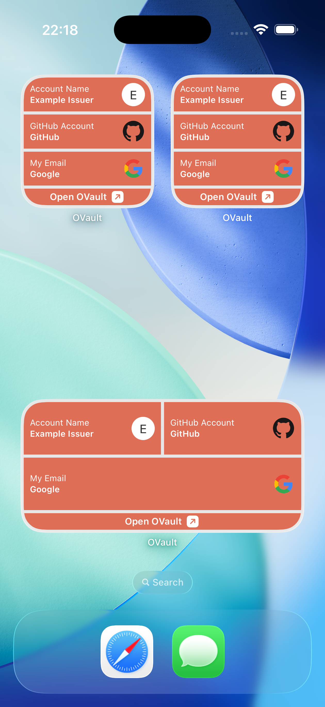
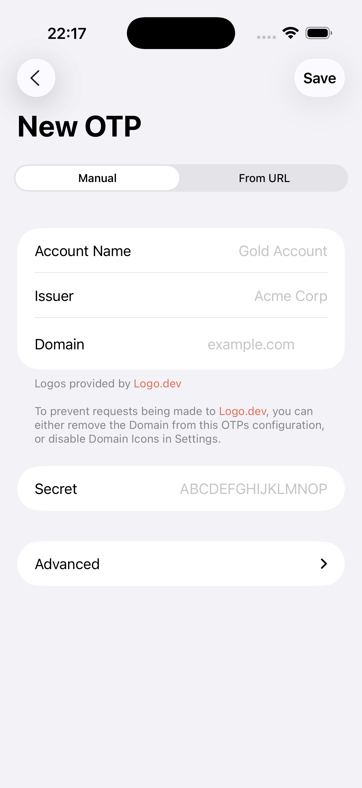

# OVault

OVault is a super simple OTP app that lets you view and manage OTPs for all your accounts. Set up OTPs by scanning QR codes with your devices Camera App, or by manually providing the OTP secret to the app.

## Features

- Copy OTP codes to Clipboard from the app
- View OTP codes on your Home Screen or your Mac Notification Centre using our Widgets, without ever needing to open the app
- Scan QR codes for adding OTPs both in-app or using your devices Camera app
- Reveal your OTP secrets to allow for effortless migration of OTPs to other devices or OTP apps
- OTP data is synchronised using iCloud Keychain, so it is available across all your devices and syncs between device upgrades
- 100% local-only processing. No data (not even usage data) is sent to any services outside of your iCloud Keychain (if enabled on your device)

## Screenshots

  

  

  

